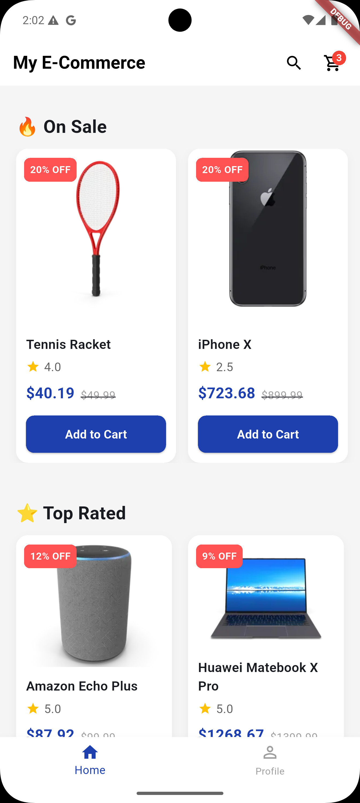
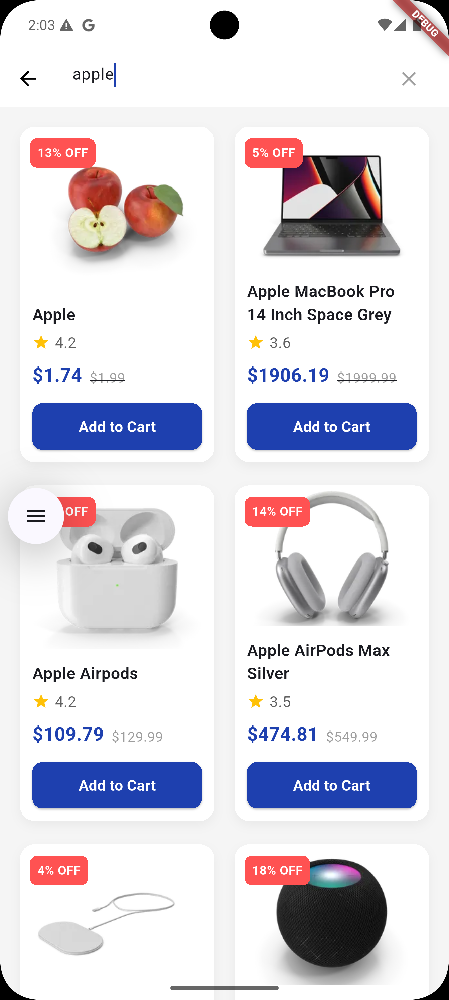
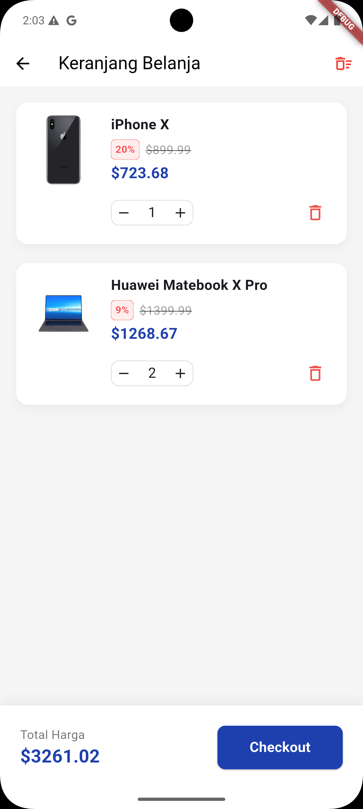
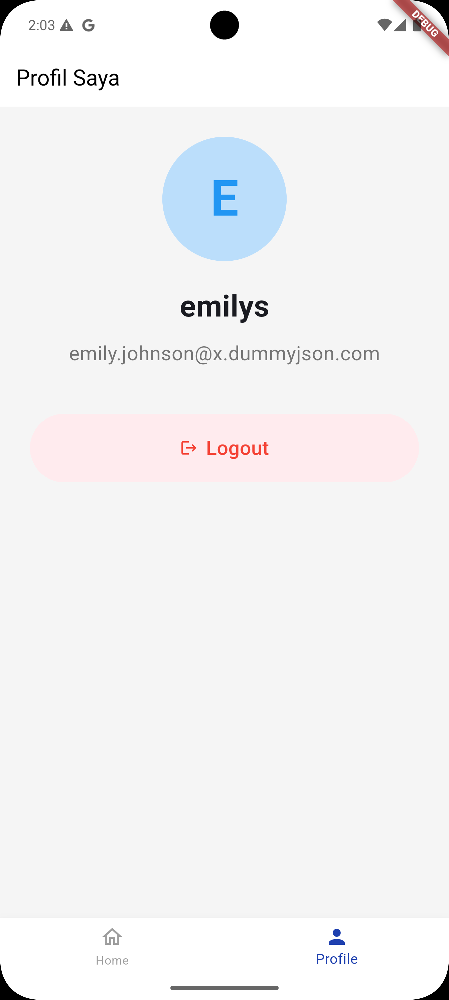

# mini-ecommerce

Aplikasi e-commerce sederhana yang dibangun menggunakan Flutter, berfokus pada skalabilitas, pemeliharaan (*maintainability*), dan *Clean Code*. Aplikasi ini mengonsumsi REST API dari [DummyJSON](https://dummyjson.com/) untuk mensimulasikan fungsionalitas e-commerce pada umumnya.

[](https://drive.google.com/file/d/1gYBXaz-y3Qb5XQtBSlTras6sVFJyjcQn/view?usp=sharing)
[](link_video_anda_disini)

---

## 📸 Screenshots

| Home Page | Search Page | Cart Page | Profile Page |
| :---: | :---: | :---: | :---: |
|  |  |  |  |

---

## 🚀 Fitur Utama

- **Otentikasi (Authentication):**
  - Login menggunakan kredensial (Username & Password).
  - *Auto-login* melalui penyimpanan token yang aman.
  - Sesi *Logout* yang akan membersihkan data lokal secara otomatis.
- **Eksplorasi Produk:**
  - Halaman Utama (Home) dengan bagian *On Sale* dan *Top Rated*.
  - Halaman Pencarian Produk dengan fitur *infinite scrolling* (pagination) dan *auto-focus*.
  - *Shimmer loading effect* saat mengambil data.
- **Manajemen Keranjang (Cart):**
  - Menambahkan produk ke keranjang (hanya untuk *user* yang sudah *login*).
  - Menambah/mengurangi kuantitas produk.
  - Menghapus item individual atau mengosongkan seluruh keranjang.
  - *Badge* notifikasi jumlah barang pada ikon keranjang di *AppBar*.
  - Data keranjang persisten (tersimpan secara lokal).
- **Profil Pengguna:**
  - Menampilkan informasi *user* (Nama & Email) bagi yang sudah terautentikasi.
  - Tampilan *Guest* bagi pengguna yang belum melakukan otentikasi.

---

## 🛠️ Pendekatan Teknis & Arsitektur

Proyek ini dibangun di atas prinsip **Clean Architecture** untuk memisahkan *business logic* dari UI dan mempermudah pengujian (*testing*). Struktur aplikasi dibagi menjadi tiga lapisan (*layers*):

1. **Domain Layer:** Berisi entitas dasar (*Entities*) dan *abstract contracts* (*Repositories*) yang tidak bergantung pada *library* eksternal mana pun.
2. **Data Layer:** Menangani pengambilan dan penyimpanan data melalui *Remote Data Source* (API) dan *Local Data Source* (Local Storage), serta melakukan *mapping* data (Models).
3. **Presentation Layer:** Berisi *UI* (Pages & Widgets) dan *State Management* (BLoC).

### Tech Stack & Libraries

- **State Management:** `flutter_bloc` & `equatable`
- **Dependency Injection:** `get_it`
- **Networking:** `dio`
- **Local Storage:** - `hive` & `hive_flutter` (Custom Adapter secara manual, tanpa `hive_generator` untuk efisiensi *build* dan mencegah konflik dependensi).
  - `flutter_secure_storage` (Untuk penyimpanan Token Otentikasi).
- **UI & Styling:**
  - `flutter_screenutil` (Untuk tampilan UI yang responsif di berbagai ukuran layar).
  - `shimmer` (Untuk efek *loading skeleton*).
- **Testing:** `bloc_test`, `mocktail`, `flutter_test`

---

## 📂 Struktur Direktori

```text
lib/
 ┣ core/
 ┃ ┣ di/                   # Konfigurasi Dependency Injection (get_it)
 ┃ ┣ network/              # Setup Dio Client
 ┃ ┣ presentation/         # Global Pages (seperti MainPage/BottomNav)
 ┃ ┗ utils/                # Constants (AppColors) & Helpers (CartHelper)
 ┣ features/
 ┃ ┣ auth/                 # Fitur Otentikasi (Login, Auto-login, Splash)
 ┃ ┣ cart/                 # Fitur Keranjang Belanja (Hive Storage)
 ┃ ┣ product/              # Fitur Produk (Home, Search, List)
 ┃ ┗ profile/              # Fitur Profil User
 ┗ main.dart               # Entry point aplikasi
```

---

## 💻 Cara Menjalankan Aplikasi

1. Pastikan Anda telah menginstal [Flutter SDK](https://docs.flutter.dev/get-started/install) (versi 3.0.0 ke atas).
2. *Clone repository* ini:
   ```bash
   git clone [https://github.com/username/mini-ecommerce.git](https://github.com/username/mini-ecommerce.git)
   ```
3. Masuk ke direktori proyek:
   ```bash
   cd mini-ecommerce
   ```
4. Unduh semua dependensi:
   ```bash
   flutter pub get
   ```
5. Jalankan aplikasi di perangkat atau emulator:
   ```bash
   flutter run
   ```

---

## 🧪 Testing

Aplikasi ini mencakup *unit testing* dengan pola **AAA (Arrange, Act, Assert)**, khususnya pada lapisan BLoC (*Business Logic*). Untuk menjalankan *test*, gunakan perintah:

```bash
flutter test
```

---

**Author** Mochammad Arsyad Amienullah  
Mobile Developer | Surabaya, Indonesia